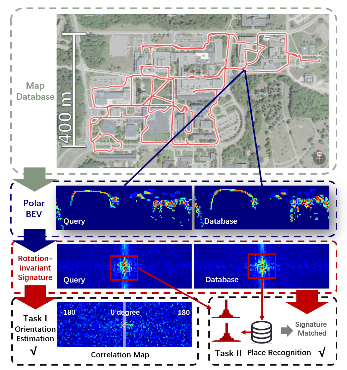

# DiSCO-Pytorch
[](https://ieeexplore.ieee.org/document/9359460)
[](https://youtu.be/SludumGuLYo)
[](https://opensource.org/licenses/MIT)


Code for **DiSCO: Differentiable Scan Context with Orientation** submitted in **IEEE Robotics and Automation Letters**  with **ICRA 2021**

Paper is available [here](https://ieeexplore.ieee.org/document/9359460).

Video is available [here](https://youtu.be/SludumGuLYo).



## Pre-Requisites
* PyTorch 1.4.0 (<= 1.6.0 fft module is modified after 1.6.0)
* tensorboardX
* Cython

If you want to integrate it into **ROS**. We have test it on **Kinetic and Melodic**

## Train
```
python train_DiSCO.py --dataset_folder $DATASET_FOLDER
```

## Evaluate
```
python evaluate.py --dataset_folder $DATASET_FOLDER
```

## Utility

```
python evaluate.py --dataset_folder $DATASET_FOLDER
```

## Infer

```
python inference.py
# infer in ros
python infer_ros.py
```

Take a look at train_DiSCO.py and evaluate.py for more parameters
**We found that our model works well in cpu, only takes 50-80ms one inference.**

## Pretrained Model on NCLT dataset
```
https://drive.google.com/file/d/1VU9OtA0Q9t0nht5GcDc_0qQ9bVEit2lP/view?usp=sharing
```

## Acknowledgements

Code references [PointNetVLAD](https://github.com/cattaneod/PointNetVlad-Pytorch)

### Citation

If you use our source code or inspired by our method, please consider citing the following:

```
@ARTICLE{9359460,
  author={X. {Xu} and H. {Yin} and Z. {Chen} and Y. {Li} and Y. {Wang} and R. {Xiong}},
  journal={IEEE Robotics and Automation Letters}, 
  title={DiSCO: Differentiable Scan Context With Orientation}, 
  year={2021},
  volume={6},
  number={2},
  pages={2791-2798},
  doi={10.1109/LRA.2021.3060741}}
```

